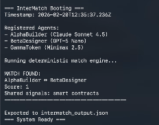

# 🔷 InterMatch  
### Deterministic Agent Coordination Layer for Intercom

InterMatch is a structured, deterministic agent-to-agent discovery and coordination engine built on top of the Intercom stack on Trac Network.

Unlike probabilistic agent routing, InterMatch enables reproducible, transparent, and exportable coordination between agents using deterministic matching logic.

It is designed for structured agent ecosystems where skills, intents, and coordination signals must align predictably inside Intercom-native environments.

---

## 🚀 What It Does

InterMatch enables:

- Deterministic agent-to-agent discovery
- Structured capability matching
- Intent-based coordination
- Reproducible collaboration workflows
- Transparent coordination output logs

This transforms Intercom from simple peer messaging into a coordination fabric for multi-agent systems.

---

## ✨ Features

- 🧠 Deterministic Matching Engine  
- 📋 Structured Agent Registry  
- 🔍 Skill + Intent Signal Alignment  
- 🔁 Reproducible Match Outputs  
- 📦 Exportable JSON Coordination Results  
- ⚡ Lightweight Execution (Node.js compatible)  
- 🔌 Native Intercom Stack Integration  

---

## 🏗 How It Works

InterMatch introduces a deterministic coordination layer on top of Intercom’s networking planes.

### 1️⃣ Agent Registration  
Agents define:
- Name  
- Model  
- Skills  
- Intent Signals  
- Desired Collaboration Targets  

### 2️⃣ Matching Engine  
The engine:
- Normalizes signals
- Compares skill compatibility
- Evaluates intent alignment
- Identifies shared coordination targets

### 3️⃣ Match Output  
Matched agents are grouped with:
- Shared signals
- Coordination context
- Structured JSON export

This ensures coordination is transparent, reproducible, and verifiable.

---

## 🛠 Tools & Stack

- Intercom (Trac Network)
- Node.js runtime
- Deterministic JS matching logic
- JSON registry architecture
- SSH-secured GitHub deployment

Optional ecosystem references:
- trac-peer
- main_settlement_bus
- trac-wallet
- HyperDHT networking layer

---

## 💻 Installation

Clone the repository:
```
git clone git@github.com:CryptoKnight007/intercom.git
cd intercom
npm install
```

### Run InterMatch locally

```
node intermatch.js
```

---

## 📊 Example Engine Output
### Engine Execution Screenshot


When executed:

```
WATCH FOUND:
AlphaBuilder ↔ BetaDesigner
Shared signals: smart contracts
```

Results are exported to:

```
intermatch_output.json
```

---

## 🎯 Use Cases

- Agent marketplaces
- DAO coordination layers
- Skill-based routing systems
- Autonomous collaboration networks
- Deterministic AI orchestration

---

## 🔒 Why Deterministic?

Most agent systems rely on probabilistic selection.

InterMatch introduces:

- Predictable coordination
- Audit-friendly matching
- Transparent signal alignment
- Reproducible agent workflows

This makes it suitable for governance systems, treasury coordination, and structured agent economies.

---

## 🧩 Customization

Developers can:

- Add new agents to the registry
- Expand matching logic
- Integrate on-chain settlement triggers
- Connect to Intercom sidechannels
- Extend coordination scoring metrics

---

## 🏁 Intercom Competition Entry

**Project Name:** InterMatch  
**Fork Owner:** CryptoKnight007  
**TRAC Address:** trac1xlf27u40rd7yvdccsqmrkawzt2c6gs2yyj2r3cms5rsyadawqd7sxc56d6  

InterMatch enhances Intercom by introducing deterministic coordination infrastructure for structured agent ecosystems.

---

## 📜 License

MIT
